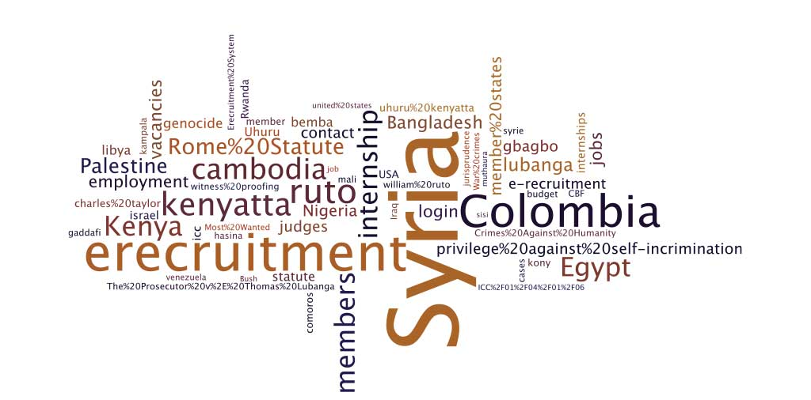

## Search terms - (September 2012 -- 2013)
Here's the terms which user searched for most during a year. Notice “Egypt” is the top search term along with “Columbia” suggesting lots of interest in where the ICC could or could not operate.

## Search terms - (September 2013)
Here's the terms which user searched for most during one month. Notice “Syria” is the top search term backing up the conclusions over the year (previous slide) that lots of interest in where the ICC could or could not operate.

